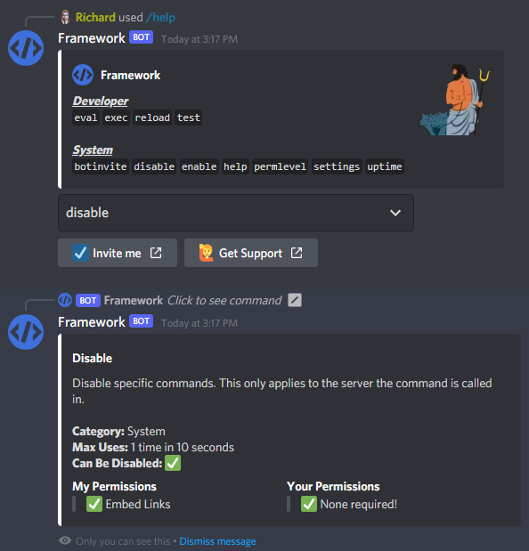
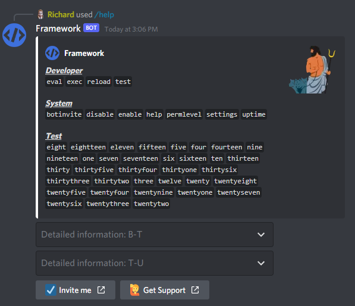
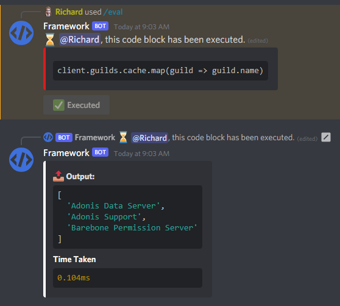

# Archived
This repo has been archived, don't use this. It's outdated, opinionated and overall not my best work as this was my first JavaScript project. I don't think this will be much help to anyone, but would you part ways with your (first) baby? 😭

# discord.js-bot-framework

This is a framework build on top of [discord.js](https://github.com/discordjs/discord.js "discord.js on Github") for quickly and easily creating powerful [Discord](https://discord.com/ "Official Discord Website") bots. You don't need much Javascript experience to get started on a project using this framework, if you want to quickly add new commands, check out [this guide to adding new commands](./tutorial/2AddingCommands.md). Still not sure where to start? Come join my [Discord Server](https://discord.gg/V8N5QqD8qX), where I'll try and answer all the questions you have.

With [Message Content Access becoming a privileged intent](https://support-dev.discord.com/hc/en-us/articles/4404772028055-Message-Content-Access-Deprecation-for-Verified-Bots "source") I thought I'd build a framework where you're pretty much ready to go after installing it. This framework doesn't even listen to the `message/messageCreate` event. On every restart the framework will check for any changes in your Slash Command data and automatically update it accordingly.

Zero to none experience with Javascript? Check out [this page](./tutorial/1GettingStarted.md) where you can follow along step-by-step to create your own Discord bot **using this framework**.

---
# Includes
- Command handler (scroll further down to see all the information)
- Event/listener handler
- Permission handler
- Slash Commands
- Buttons
- Select Menus
### Commands
Complete | Notes
-------- | ---------
✅ Built-in Slash Commands | [Message Content Access is becoming a privileged intent](https://support-dev.discord.com/hc/en-us/articles/4404772028055-Message-Content-Access-Deprecation-for-Verified-Bots "source") and that's why this framework makes full use of interactions (slash commands, buttons and select menus) instead of message content. In fact, we don't even listen to the `messageCreate` event.
✅ Automatically update Slash commands | This framework will check for any changes to your Slash Command data and update it accordingly.
✅ Different types of slash commands | Configure your command to be *global*, *test server only* or *server specific*. Allowing you to test properly, release the command to specific servers and finally make it available globally.
✅ Required and optional commands | Configure whether or not your command is a required command or optional. Required commands ***can't*** be disabled by individual servers, optional commands ***can***.
✅ Throttling | Configure command cooldowns for all your commands! Allow infinite usages for a command that barely does anything, and restrict resource-heavy commands to 1 usage in 120 seconds. (That's just an example, you can literally do anything.)
✅ Permission | Configure a required permission level for your commands. Also configure any *additional* required [Discord Permissions](https://discord.com/developers/docs/topics/permissions#permissions-bitwise-permission-flags "All available permissions") for the client/bot and the member calling the command. Very useful for moderation functionality.
✅ Global disable & enable | Found a major bug in one of your commands? Disable it in your slash configuration export and the Slash Command will automatically be disabled, be it global, test server or server specific commands.
✅ NSFW channel restrictions | Configure whether or not your command is SFW and automatically restrict it to NSFW channels if it's not.

Incomplete | Notes
---------- | -----
⌛ Add support for DM commands | At the time of writing this, Slash Commands can be called in a bots DM channel. I'd like to add full support for DM Slash Commands.

# Media
### The help command - Select a command for detailed information

---
### The help command is fully modular, it will automatically apply more Select Menus based on the amount of commands

---
### A powerful eval command, with appropriate protection to protect it from the wrong hands

